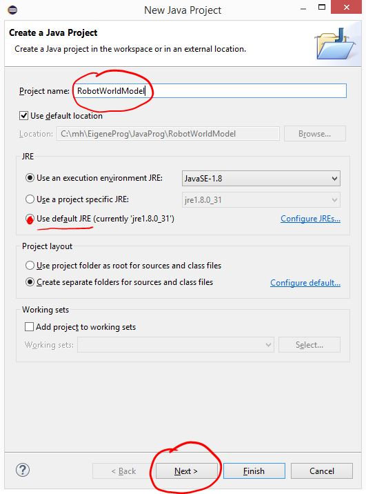
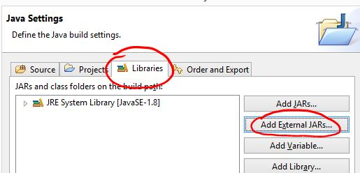

# Create a new Database using the OrientDB Java API
OrientDB offers several possibilities to create new databases:
* Use Studio to [create a new database interactively](http://orientdb.com/docs/last/orientdb-studio.wiki/Home-page.html#create-a-new-database)
* Use Console and the [create database command](http://orientdb.com/docs/last/orientdb.wiki/Console-Command-Create-Database.html)
* Use the Java API to create a database with a Java program.

## Create a Database using the Java API
### Create a Java Project
In this tutorial we will use the last method. To do so we will first create a Java application.

Start Eclipse on your computer. In the main menu of eclipse click on *File* > *New* > *Java Project*

A "New Java Project"-dialog opens. Type in a name for the project e.g. *RobotWorldModel* and choose the default JRE (Java Runtime Environment). Click *Next* to continue.

In the following "Java Settings"-dialog click on the *Libraries* tab and then on *Add External JARs...*

A file dialog opens. Navigate to your orient root directory and then to the jar-directory. Choose the following JAR-files (where x.x.x is the version number installed on your computer):
* blueprints-core-x.x.x.jar
* concurrentlidedhashmap-lru-x.x.x.jar
* orientdb-client-x.x.x.jar
* orientdb-core-x.x.x.jar
* orientdb-enterprise-x.x.x.jar
* orientdb-grafphdb-x.x.x.jar

Click Finish - a new empty Java project is created and is added to the list of your Java projects in your workspace. You can see it in the Package Explorer. If it is not visible open it with *Window* > *Show View* > *Package Explorer*

### Create a new Package
In the package explorer choose your new project RotWorldModel. Click on the "New Package"-icon or click on *File* > *New* > *Package* in the main menu.  

