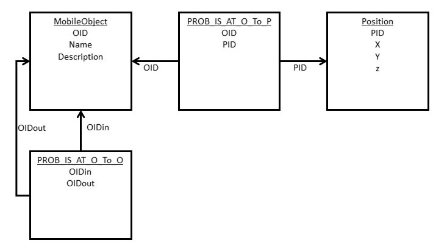

# Create the Search Method

If you prefer you can watch a screencast video:
<a href="RWM-Search-2.mp4
" target="_blank"></a>

The special task of a service robot we will simulate in this tutorial is to search for a mobile object. Imagine that a person instructs the robot to bring a glass of apple juice. The robot has to understand the spoken instruction, parse it into simple actions, plan the actions and finally perform the task. In this example the robot has to search for a juice glass then to search for apple juice, bring the juice to the glass, fill the glass with the juice and finally bring the glass to the person.

In this tutorial we will consider one frequent task: **search for an object**

This search algorithm consists of the following parts:

1. [Get the the parameters for the search using a simple GUI](download_a_simple_gui.md):
    * the search Object
    * and for the simulation the current position of the robot
    * and the current position of the search object
1. [Retrieve all positions from the database where the search object could be](#retrieve-positions-of-search-object) together with the probability (score) that the object is really there.
1. [Calculate the path to each possible position](#calculate-the-paths-to-all-positions-in-the-position-list)
1. Decide to which position the robot should go first
1. [Go to this position and look for the search object there](#repeat-the-search-until-the-object-is-found-or-all-possible-positions-are-visited)
1. If the object is really there or if this is the last possible search position show the robot's search path
else continue the search with the remaining positions at **step 3**.

To implement the search algorithm create a new package in Eclipse: **operations**

Then create a new JAVA class **Operations** in this package.

### Retrieve Positions of Search Object

Inside of the class Operations write a new method ``createPosList()``. As the name says the result should be a list of positions and positions are vertices. To determine possible positions of the search Object the method needs the search object as a parameter which is also a vertex. So we get:

```java
public List<Vertex> createPosList(Vertex obj) {
```

To retrieve possible positions of the search object we can use SQL and query the PROB_IS_AT subclass of E. There are two alternatives for each PROB_IS_AT edge:

* Either we have a direct connection from an object to a position
* Or we we have a connection from one object to another object, e. g. a bottle of milk is inside the refrigerator.

#### Hence we first retrieve all directly connected positions of our search object. This is a simple SQL-query:
```java
OSQLSynchQuery query1 = new OSQLSynchQuery ("select in as pos, Score as combiScore from PROB_IS_AT where out = ? and in.@class = 'Position'");

```
Each edge connects two vertices: **out** specifies the source vertex where the edge comes out and **in** specifies the target vertex where the edge goes into. **out** must be our search object. Instead of doing some String-operations and insert the **rid** (record id) of the object into the where condition we use a [prepared query](http://orientdb.com/docs/last/Document-Database.html#prepared-query). The '?' in ``where out = ?`` is a parameter that is passed at execution time.

Since we are only interested in PROB_IS_AT edges leading to a *Position* we add a second condition: the class of the target vertex must be 'Position'. The record attribute ``@class`` returns the class of a vertex.

Then the query is executed: ``db.command(query1).execute(obj)``

The result is not a ``List`` but an ``Iterable``. So we have to convert it into a list. However we not only want to store the positions but also their *Score* value. Hence we define a new class ``PositionScore`` for pairs of position and score.

```java
package operations;

import com.tinkerpop.blueprints.Vertex;

/*
 * Data structure to store a Position vertex together with a calculated score
 */
public class PositionScore {
	public Vertex pos;
	public Float score;

	public PositionScore(Vertex pos, Float score) {
		this.pos = pos;
		this.score = score;
	}
}
```

Now  we can declare a list where the positions are collected in ``createPosList()``.

```java
List <PositionScore> posList = new ArrayList <PositionScore> (); //Result list
```

Insert each position returned by the database into this list.

```java
for (Vertex result: (Iterable<Vertex>) db.command(query1).execute(obj)) {
	posList.add(new PositionScore (result.getProperty("pos"), (Float) result.getProperty("combiScore")));
}
```

#### As second step we retrieve all positions where an object is connected to another object

The SQL-query is a little bit more complicated. We want to find the following situation:

MobileObject obj --> PROB_IS_AT e1 --> another mobile object --> PROB_IS_AT e2 --> Position pos

To get the *Position* vertices we have to follow the arrows. Start the search with ``PROB_IS_AT e1`` which starts at the *MobileObject* obj. Hence the FROM- and WHERE-part of the SQL-query is ``from PROB_IS_AT where out = ?``. ``in`` delivers the *other object* and from this object we want to get all outgoing edges of class 'PROB_IS_AT': ``in.outE('PROB_IS_AT')`` .

So we try the following query:
```sql
select @rid as e1, in.outE('PROB_IS_AT') as e2 from PROB_IS_AT where out = ? and in.@class = 'Object'
```

The result of this query is an edge together with a list of edges like in this example.

| e1 | e2 |
| -- | -- |
| #20:1 | [#20:2, #20:3] |
| #20:10 | [#20:4, #20:5] |

However we want a list of pairs e1, e2 as a result:

| e1 | e2 |
| -- | -- |
| #20:1 | #20:2 |
| #20:1 | #20:3 |
| #20:10 | #20:4 |
| #20:10 | #20:5 |

The **unwind** expression will create one pair of edges in the result set for each e2 entry. We adjust our query to
```sql
select @rid as e1, in.outE('PROB_IS_AT') as e2 from PROB_IS_AT where out = ? and in.@class = 'Object' unwind e2
```

Finally we don't want to get the edges but *Positions* and *scores*. So we wrap the query by an outer SQL-query. From e2 we retrieve ``e2.in`` as position *pos* and from e1 and e2 we calculate a combined score: ``eval('s1 * s2 / 10') as combiScore``. The division by 10 is necessary because our score values vary from 0 to 10. Attention! The eval-function expects the formula as String.

```sql
select e2.in as pos, e1.Score as s1, e2.Score as s2, eval('s1 * s2 / 10') as combiScore from (select @rid as e1, in.outE('PROB_IS_AT') as e2 from PROB_IS_AT where out = ? and in.@class = 'Object' unwind e2)
```

Again we iterate over the result set and fill our result list ``posList`` with ``PositionScore`` pairs.`

####Excursus: Comparison to query in ralational database

If you like you can compare the last OrientDB query on a **graph database** with a corresponding query on a **relational database**. Suppose we had three tables: A Position-table with the coordinates x, y and z as columns and a PID as primary key, a MobileObject-table with OID as primary key a connection table PROB_IS_AT_O_To_O-table with a score column and with OIDout and OIDin as foreign keys which connects two mobile objects and a connection table PROB_IS_AT_O_To_P with a score column and OID and PID as foreign keys which connects an object with a position.  
  
Three slow join operations are necessary for the query, using a relational database.

```sql
SELECT pos.x, pos.y, pos.z, proboo.score * probop.score / 10 as combiScore
FROM PROB_IS_AT_O_To_O proboo, MobileObject mo, PROB_IS_AT_O_To_P probop, Position pos
WHERE   proboo.OIDin = mo.OID AND
        mo.OID = probop.OID AND
        probop.PID = pos.PID AND
        proboo.OIDout = ?
```
####Excursus: Traversing a graph

Imagine there would be more than one indirection possible in the PROB_IS_AT relation between mobile objects, e.g. a glass is on a tablet which is on a table. Then we would have this representation in the graph:

MobileObject o1 -PROB_IS_AT-> MobileObject o2 -PROB_IS_AT-> ... MobileObject on -PROB_IS_AT-> Position p

If we don't know how many times we have to follow PROB_IS_AT from one mobile object to the next until we reach a position we cannot use SELECT. For these cases OrientDB offers the TRAVERSE command. See the [documentation](http://orientdb.com/docs/last/SQL-Traverse.html) for the full syntax of TRAVERSE. The syntax for a simple form is: 
```sql
TRAVERSE <fields> FROM <target>
```
In our application the *target* is a single vertex: the search object o1. In *fields* specify the fields necessary to follow the path: ```outE('PROB_IS_AT')``` to get all edges of class PROB_IS_AT starting at o1 and later at o2, o3 ... on, and ```PROB_IS_AT.in``` to get the destination vertices of these edges: o2, ... on, p.

Surround the TRAVERSE command with a SELECT command to specify the desired result of the query (projection operation) and a  *WHERE condition* to filter only the paths which end at a position: ```WHERE @class = 'Position'```. Combine the pieces to the complete SQL command if o1 is the vertex with id #19:3:
```sql
SELECT @rid, $path
FROM (
  TRAVERSE outE('PROB_IS_AT'), PROB_IS_AT.in
  FROM #19:3
)
WHERE @class = 'Position'
```

### Calculate the paths to all positions in the position list

If you prefer you can watch the next screencast video:
<a href="RWM-Search-3.mp4
" target="_blank"></a>

Having implemented ```CreatePosList()``` we can now implement the method ```SearchForObject()``` and use ```CreatePosList()``` there. Create a function ``searchForObject()`` which first calls ``createPosList()``.

```java
public String searchForObject (Vertex start, Vertex dest, Vertex searchObject) {
		
	ArrayList <PositionScore> posList = createPosList (searchObject); //Create list of positions where object could be together with scores and store it in posList
	if (posList.isEmpty()) return "No positions exist where object " + searchObject.getProperty("Name") + " could be";
	String startRid = start.getId().toString();

```

The search is a routing task. One possible routing algorithm is the [Dijkstra algorithm](https://en.wikipedia.org/wiki/Dijkstra%27s_algorithm). It is implemented in OrientDB ([dijkstra function in OrientDB](http://orientdb.com/docs/last/SQL-Functions.html#dijkstra)) and thus can be executed on the server without data transfer to the client.

We iterate the position list *posList* and for each position calculate the path to it from the current position of the robot, the estimated time to traverse the path and finally the ratio of passing time to the score of the position. The lower the pass time or the higher the score, the better is that position. The position with the least (pass time / score)-ratio is chosen as the next position where the robot should go.

```java
public String searchForObject (Vertex start, Vertex dest, Vertex searchObject) {
  ... // some other code is discussed later (see below)
  PositionScore bestPos = null; // Store position with best passTime/Score ratio found so far in bestPos
  float bestCost = Float.MAX_VALUE; // bestCost = passTime/Score ratio of best bestPos
  Iterable<OrientVertex> pathToBestPos = null;
  for (PositionScore ps: posList) {
	// let OrientDB calculate the best path to position ps.pos using the dijkstra algorithm
	String destRid = ps.pos.getId().toString(); // id of Vertex dest
	String dijkstraQueryString = "SELECT dijkstra(" + startRid + ", " + destRid + ", 'PassTimeSec', 'BOTH', 'IS_CONNECTED_TO')";
	OSQLSynchQuery dijkstraQuery = new OSQLSynchQuery(dijkstraQueryString);
	Iterable <Vertex> result = db.command(dijkstraQuery).execute();
```

>**NOTE**: The result of ``db.command(<OSQLSynchQuery>).execute()`` is always a list of vertices as Iterable. Even if you expect a list of integer e. g. in the query  ``SELECT MIN(x) FROM Position GROUP BY inLocation`` you get a list of vertices with a property "MIN". 

Therefore you have to iterate ``Iterable <Vertex> result`` though result has only one element. With ``v.getProperty("dijkstra")`` you get the result of the dijkstra function which is the list of vertices on the path.

```java
	Iterable <OrientVertex> pathIterable = null;
	for (Vertex v: result) { pathIterable = v.getProperty("dijkstra"); break; }
	if (pathIterable != null) {
		float timePerScore = calculatePathPassTime(pathIterable) / ps.score;
		if (timePerScore < bestCost) { // is the new position better than the best position so far regarding timePerScore?
			bestPos = ps;
			pathToBestPos = pathIterable;
			bestCost = timePerScore;
		}
	}
}
```

### Repeat the search until the object is found or all possible positions are visited

Go the position with the best (passTime/Score)-ratio and look for the search object there. If the object is there the search is finished. Otherwise remove the current position from the position list and repeat the search: this is the enclosing ``while``-loop.

```java
while (!posList.isEmpty()) {
    ... // search using the dijkstra function, see code above
    
	if (pathToBestPos != null) {
		ArrayList <Vertex> currentPath = new ArrayList <Vertex> ();
		for (OrientVertex v: pathToBestPos) {
			currentPath.add(v);
		}
		searchPath.add(currentPath);
		if (bestPos.pos.getId().toString().equals(dest.getId().toString())) {
	        System.out.println("Object " + searchObject.getProperty("Name") + " found at position " + bestPos.pos.getId().toString());
			return "Object " + searchObject.getProperty("Name") + " found at position " + bestPos.pos.getId().toString();
		}
		startRid = bestPos.pos.getId().toString(); // Update current position of robot which is new start
	} else {
		// pathToBestPos == null means that there is no path to any possible position of the object.
		System.out.println("Robot cannot reach the object " + searchObject.getProperty("Name"));
		return "Robot cannot reach the object " + searchObject.getProperty("Name");
	}
	posList.remove(bestPos);
	if (posList.isEmpty()) {
		System.out.println ("Robot could not find Object " + searchObject.getProperty("Name"));
		return "Robot could not find Object " + searchObject.getProperty("Name");
	}
}
```

Since the the function ``searchForObject()`` returns a string with information about the success of the search the search path has to be stored in a variable: ``private ArrayList <ArrayList <Vertex>> searchPath`` with this instruction: ``searchPath.add(currentPath)``

The search function is now ready to use. In the next step you can download a GUI that calls the search method.

