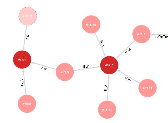

# Database Schema
##Schema-Full, Schema-Less and Schema-Hybrid Mode
OrientDB can be used to store [graph databases](http://en.wikipedia.org/wiki/Graph_database). A graph database consists of **vertices** or **nodes** and **edges** which connect the vertices. Small graphs can easily be represented graphically using circles or squares for the vertices and lines for the edges.

Figure 4: Visual representation of a graph

Vertices and edges store information in properties. E.g. you may want to create a vertex to store a person with a Name, an E-Mail and a Telephone property.

With OrientDB it is possible to work in a **schema-less mode**. In this mode there are only two types of records in your database: vertices stored in class V and edges stored in class E. Each vertex may have different properties. The schemaless mode is very good if the objects differ widely in their properties or if your schema is changing quickly.

However the schema-less mode is not the best choice if different users access the database. One user might call a property "color" the next one "colour". OrientDB cannot identify both properties being identical. To avoid this error it is better to work in **schema-full mode** where the properties of different vertex classes are predefined.

OrientDB offers a third mode, the **schema-hybrid** or **schema-mixed mode**, where some properties are fixed and other ones can be freely defined by the users. Read more about the different modes in the [OrientDB dcumentation](http://orientdb.com/docs/last/orientdb.wiki/Graph-Schema.html).

In this tutorial we will use the schema-full mode to avoid errors especially when different applications access the database. This chapter has the following sections:
1. First [create a new database using JAVA](create_new_database.md)
2. Then [define and implement the schema for Locations.](schema_for_locations.md)
3. Then [define and implement the schema for Objects](develop_the_schema_for_objects.md).
4. Finally [create some unit tests for the schema.](unit_tests.md)

