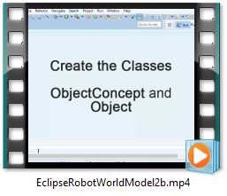
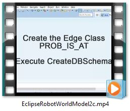

# Develop the Schema for Objects
If you prefer to wach the next steps as screencast video click on the video start page.

<a href="EclipseRobotWorldModel2b.mp4
" target="_blank"></a>

While the *location* class stores all immobile objects we need an **object class** to store mobile objects. Of course the border between immobile locations and mobile objects is fluent. A chair will often be moved to other positions, a table may be moved a little bit after cleaning the floor and a heavy wardrobe normally isn't moved at all. If you want to read again about the details of objects go back to the chapter [Motivation](motivation.md#Objects-and-Object-Concepts).

For each real object we want to store its size as surrounding cuboid with length, width and hight. To connect these three dimensions we define a Size3D class. Each object then gets an embedded Size property of type Size3D. Since Size3D isn't a subclass of V it cannot be created using ``db.createVertexType("Size3D")`` but has to be defined as document class. One possibility to do this is to use SQL. SQL can be executed inside Java programs with ``db.command(new OCommandSQL("SQL-string").execute()``.
Add to the main method in our CreateDBSchema class:
```java
db.command(new OCommandSQL ("create class Size3D")).execute();
db.command(new OCommandSQL("create Property Size3D.Length INTEGER")).execute(); // length in cm
db.command(new OCommandSQL("ALTER PROPERTY Size3D.Length MANDATORY true")).execute();
db.command(new OCommandSQL("create Property Size3D.Width INTEGER")).execute();
db.command(new OCommandSQL("ALTER PROPERTY Size3D.Width MANDATORY true")).execute();
db.command(new OCommandSQL("create Property Size3D.Hight INTEGER")).execute();
db.command(new OCommandSQL("ALTER PROPERTY Size3D.Hight MANDATORY true")).execute();
```

Now we can define the classes for objects and object concepts.
```java
OrientVertexType objectConcept = db.createVertexType("ObjectConcept", namedVertex); // abstract objects
OrientVertexType object = db.createVertexType("Object", namedVertex);
object.createProperty("Path_to_Histogram", OType.STRING); // Link to file
OClass size3D = db.getRawGraph().getMetadata().getSchema().getClass("Size3D");
object.createProperty("Size", OType.EMBEDDED, size3D);
```

At last we define the edge classes. Since we already have defined the *IS_A* and *IS_PART_OF* edge classes for locations we only need to add the edge class **PROB_IS_AT** which stores the probability of an object beeing at a location, position or in/on/at another object. Therefore this edge class has some sort of **probability** as a property. In fact not a probability but a **score** is stored. Additionally a **hight** may be stored as information at which level an object can be found e. g. in a cupboard or on a shelf.

If you prefer to wach the last steps as screencast video click on the video start page.

<a href="EclipseRobotWorldModel2c.mp4
" target="_blank"></a>

```java
OrientEdgeType prob_is_at = db.createEdgeType("PROB_IS_AT");
prob_is_at.createProperty("Probability", OType.INTEGER).setMin("0").setMandatory(true).setNotNull(true);
prob_is_at.createPropery("Hight", OType.INTEGER).setMin("0");

```
Finally the database connection is closed.
```java
db.shutdown();
factory.close();
```

Now you can execute your program. Afterwords you can control the created shema using Studio or Console.

