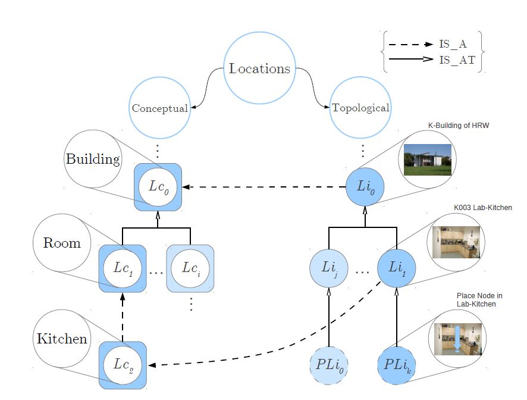
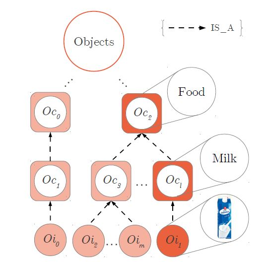
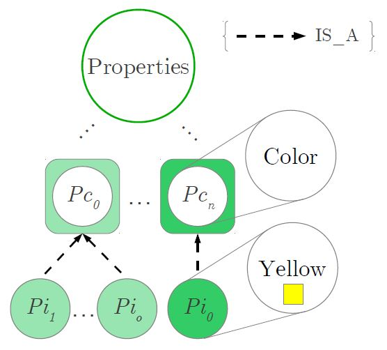

# Motivation
##Autonomous Service Robots
At the University of Applied Sciences Ravensburg-Weingarten a service robot is developed that helps elderly or disabled persons in their household. It is not a nursing robot but a service robot. Usual tasks of a service robot are to search for objects and bring them to the owner, serve the dinner, clean up the kitchen etc. This [video](http://iki.hs-weingarten.de/videos/IKI-PR-Video.mp4#t=03:41) shows a typical activity of the service robot.

This service is only possible with an autonomous robot. An industrial robot that performs the same task at the same position very accurately again and again is not suitable because the environment changes permanently: the equipment like cups, glasses, fruit etc. is located at different positions every time the robot looks for it, one time a yellow cup has to be used another time a blue one, the usual way to the kitchen is blocked by a chair, ...

Find more information about this project at [Univesity Ravensburg-Weingarten, Institute for Artificial Intelligence](http://iki.hs-weingarten.de/?lang=eng&page=aktuelles)
###World Model
The service robot can perform a lot of tasks in a permanently changing environment using its sensors: find its way avoiding obstacles at changing positions, detect and grasp objects, understand commands given in natural language etc. However to plan its activities the robot needs some information about its environment: Where are other rooms? Where are doors to get from one room to another one? Where could certain objects be? To which object class does an object belong? How can similar objects be distinguished?

In his Master-Theses **Benjamin Stähle** suggested a database structure to store the information about the robot's environment. This structure is briefly described here.

####Locations and Location Concepts
Usually the robot works in an apartment or flat. However sometimes the robot may have to do some work outside of the apartment e.g. bring something to a neighbor. The apartment consists of rooms connected by doors. The rooms may be on different floors. Thus the locations build a hierarchy connected by the "IS_PART_OF" relationship: A certain room e.g. the kitchen **is part of** the 1st floor which **is part of** an apartment which **is part of** a certain house.

There may be more than one kitchen or bathroom in one apartment. Therefore it is necessary to store the type of a location e.g. the kitchen on the 1st floor **is a** kitchen. The abstract information about location concepts forms an extra hierarchy.

####Positions
Inside of a room an autonomous robot can move using its sensors. Therefore it does not need certain positions with connections as navigation paths inside of rooms. However positions are necessary to indicate doors as connections between different rooms. Thus the robot knows where to navigate to enter another room. Also other connections between rooms like elevators are stored as positions.

The robot may store information about times usually necessary to go from one position to another one in the relation "IS_CONNECTED_TO" with the property *PassTimeSec*.

The following figure shows the topological hierarchy of real locations together with the conceptual location hierarchy.

Figure 1: Conceptual hierarchy of location concepts, location instances and place instances (example concept: place 1 in lab kitchen)

####Objects and Object Concepts
The robot has to use and interact with a lot of mobile objects. In contrast to the locations the mobile objects are not fixed at one position but can be moved, consumed, substituted by new objects etc. Similar to locations mobile objects belong to one or more object concepts. So we again use the "is a" relationship, here between mobile objects and object concepts.

Figure 2: Hierarchy of mobile objects and object concepts

####Properties of Objects
Each object has several properties that may be relevant for the service robot e.g. to distinguish similar objects by color or by size. The robot might get the instruction: "Bring me my hat!" and ask in response: "Which hat? The black one or the blue one?" Each property type like color has some possible values like Yellow, Green or Blue. Different objects may have different properties. The color e.g. is important for clothes but is not of interest for a newspaper.

Figure 3: Hierarchy of Property Concepts Pc and Property Instances Pi

