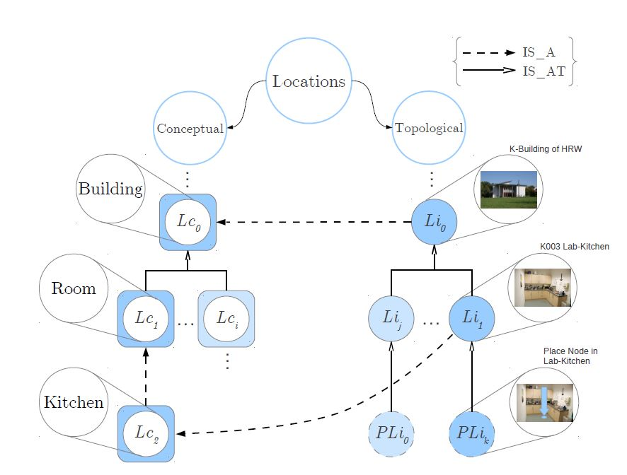

# Develop the Schema for Locations


Locations relevant for the robot are rooms, floors, houses, even outdoor locations like a yard or a street. As discussed before in the chapter [Motivation: Locations and Location Concepts](motivation.md#Locations-and-Location-Concepts) we distinguish between real locations and location concepts. Hence we have to define the vertex classes **Location** and **LocationConcept** as subclasses of V.

Each *location* needs a **name**. The persons attended by the service robot use the name to refer to the location. The name need not be unique because a location can be identified by the containing location. A command to the robot could e.g. be: "Bring this bottle of juice to the *kitchen of Mr. Millers apartment*".

Often it might be convenient to store a **description** of the location.

Location concepts also need a name and optionally a description.

To move inside of a room a robot must get the information about the **shape** of the room. A *shape* can be stored as a list of **positions** where each *position* is a triple of x-, y- and z-coordinates. ``Position`` is a subclass of ``Coordinate``.

To store a *shape* we have several options in OrientDB:
* We can connect a *location vertex* with some position vertices by an edge type "has_corner".


We need an ordered list of edges for a location vertex because the sequence of the positions is relevant for the shape. Otherwise the same set of corners could define different shapes:


* We can connect a *location vertex* with one *position vertex* by a "first_corner" edge. This position vertex is then connected to another position vertex by a "next-position" edge. 
* OrientDB is not only a graph database but also obeyes to the object oriented paradigm. Therefore a third alternative is possible using aggregation: Each location has a *shape* property which is of type *LINKLIST* or *EMBEDDEDLIST* of positions. Use *EMBEDDEDLIST* if the positions can only exist as a part of a location, use *LINKLIST* if the positions can be used for other purposes.

Let's briefly discuss the different alternatives. In the first and second alternative positions and locations are different, stand alone entities connected by a relationship. If the location is deleted the positions remain in the database. They could be used for other puposes e.g. because objects are located at these positions. The second alternative has the disadvantage that after deletion of a location the corresponding positions are still connected by the *next_corner* relationship. The application which deletes a location has to delete the corresponding *next_corner*-edges.

The third alternative (LINKLIST) connects locations and positions more tightly. Locations are the main entities and the positions forming the shape of the location are a part of the location. However the positions can exist without a location; they get an independent object id.

The last alternative (EMBEDDEDLIST) is similar to the third one but the positions are embedded in the location object. If a location is deleted they are automatically deleted, too. Embedded objects get no individual object id.

In this tutorial we will use the third alternative because *LINKLIST* is an interesting special feature of OrientDB. Since positions can also be used to indicate the position of *mobile objects* we don't embed them into locations.

## Create the Vertex Class "Position" using the Java API

If you prefer to watch the next screencast video click on the video start page.

<a href="EclipseRobotWorldModel2.mp4
" target="_blank"></a>

Remember our small Java program with the Java class *CreateDBSchema*. Up to now it consists only of two instructions which create the database "RobotWorld". We now want to add a new vertex class *Position* which consists of three Cartesian coordinates. Since the concept of a three dimensional vector may be useful for other classes let's define an abstract class *Coordinates*. Abstract classes cannot be declared with the  Tinkerpop Blueprints API. Here we use SQL and ``db.command(<OSQLCommand>).execute()``instead.

```java
/* 3 dimensional vector as abstract class
 * used as position and as size for objects.
 */
db.command(new OCommandSQL ("create class Coordinate extends V ABSTRACT")).execute(); 
db.command(new OCommandSQL ("create Property Coordinate.x FLOAT")).execute();
db.command(new OCommandSQL ("alter property Coordinate.x MANDATORY true")).execute();
db.command(new OCommandSQL ("alter property Coordinate.x NOTNULL true")).execute();
db.command(new OCommandSQL ("create Property Coordinate.y FLOAT")).execute();
db.command(new OCommandSQL ("alter property Coordinate.y MANDATORY true")).execute();
db.command(new OCommandSQL ("alter property Coordinate.y NOTNULL true")).execute();
db.command(new OCommandSQL ("create Property Coordinate.z FLOAT")).execute();
db.command(new OCommandSQL ("alter property Coordinate.z MANDATORY true")).execute();
db.command(new OCommandSQL ("alter property Coordinate.z NOTNULL true")).execute();
OClass coordinate = db.getRawGraph().getMetadata().getSchema().getClass("Coordinate");
```

Then we can use ``db.createVertexType()`` of the Blueprints API to define *Position* as a subclass of the abstract class *Coordinates*. Of course we could do that with SQL as well but this tutorial will show you several alternatives.

```java
OrientVertexType position = db.createVertexType("Position", coordinate); // Coordinate used as position
```

## Create the Vertex Classes "Location" and "LocationConcept"

OrientDB supports inheritance. Both classes, *LocationConcept* and *Location*, need a *Name* and a *Description* attribute. We will see later that other classes have a name and a description attribute, too. Therefore we first define a subclass **NamedVertex** of *V*. Then *Location* and *LocationConcept* are subclasses of *NamedVertex*.

Again the ``db.createVertexType()`` method is used. With the  ``db.createProperty()`` method the properties *Name* and *Description* are defined.
```java
OrientVertexType namedVertex = db.createVertexType("NamedVertex");
namedVertex.createProperty("Name", OType.STRING).setMandatory(true).setNotNull(true);
namedVertex.createProperty("Description", OType.STRING);
```

The result of ``createProperty()`` is of type ``OrientVertexProperty``. Therefore the method ``.setMandatory(true)`` can be applied. Again the result is a property object. So the ``.setNotNull(true)`` method can be applied in the same line. This means that each namedVertex object must have a *Name* property and the name must have a value.

Then *locationConcept* and *Location* are created as subclasses of *NamedVertex*.

*NamedVertex* could be an abstract class, but is not, because the Graph API doesn't allow to create abstract classes. If we wanted to make *NamedVertex* abstract we could not use ``db.createVertexType()`` but had to use SQL as we did for the *Coordinates* class or the Document API.

```java
OrientVertexType locationConcept = db.createVertexType("LocationConcept", "NamedVertex");

OrientVertexType location = db.createVertexType("Location", "NamedVertex");
location.createProperty("Shape", OType.LINKLIST, position);
```

Let's look at the last instruction in more detail:
*createProperty()* is a method of the OrientVertexType class. The first parameter, "Shape", is the property's name as string. The second parameter is the property's type which is LINKLIST here. Since we have a link we need a third parameter which is the linked type. Be careful not to use the name of the linked type as string but a parameter of type *OrientVertexType*.

Perhaps you wondered why the *Coordinates* class was defined as an abstract class and *Position* as a subclass. Up to now there is no difference in the structure of both classes. With the *Location* class available we can now define an additional property *inLocation* of *Position* which links a position to the room where it is located.

```java
position.createProperty("inLocation", OType.LINK, location); 
```

In a graph database usually edges represent a bidirectional relationship between classes. Hence we could declare an edge class "IN_LOCATION" between *Position* and *Location*. However we only need a unidirectional link from *Position* to *Location* which can be expressed as ``OType.LINK``. To have the other direction from *Location* to *Position*, too, would decrease performance because one location could have hundreds of positions.

## Create the Edge Classes "IS_A" and "IS_PART_OF"
Now we have defined all vertex classes related to locations. As last step we define the edge classes that express the relationships between locations and location concepts.
```java
OrientEdgeType is_a = db.createEdgeType("IS_A");
OrientEdgeType is_part_of = db.createEdgeType("IS_PART_OF");
```

If you wanted to constrain the edge type IS_A to only connect a *location* vertex with a *location concept* vertex you could explicitly add the *in* and *out* links to the IS_A class.
```java
is_a.createProperty("out", OType.LINK, location).setMandatory(true);
is_a.createProperty("in", OType.LINK, locationConcept).setMandatory(true);

```
However since we want to use the IS_A edge class also for mobile object entities we **omit these constraints**.

## Create the Edge Class "IS_CONNECTED_TO"

The robot must know which locations are connected by doors, elevators, passages etc. to navigate to desired objects. Each connection must provide information about the estimated time to pass the connection. Two positions can be connected, too. The robot can store empirical pass times to get from one position to another position in the connecting edge.

````java
OrientEdgeType is_connected_to = db.createEdgeType("IS_CONNECTED_TO");
is_connected_to.createProperty("PassTimeSec", OType.FLOAT); // Estimated time to get from position 1 to position 2

```
